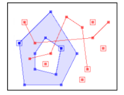

## Vector Geospatial Data

If you're coming from the Earth Sciences, we're *not referring to fields of arrows* indicating direction and magnitude .... Instead, "vector" is a term commonly used in Geographical Information Systems (GIS) to refer to **discrete geometric entities** (also referred to as objects, features or shapes) that represent or approximate distinct "things" on the land surface (or the bottom of the sea, or ...); these entity or object types typically are *not used to represent continuously varying fields, rasters or other tessellations*.

Examples include points and polygons.

## Simple Features

The [Open Geospatial Consortium (OGC)](http://www.opengeospatial.org) has defined and standardized a set of geometric objects (plus functions and operators) that are widely adopted in open source and commercial geospatial software. These [**Simple Features (SF)**](https://en.wikipedia.org/wiki/Simple_Features) represent two-dimensional planar geometric objects, as well as other more exotic types we won't address here.

We'll focus on the most basic and common types. These are made up of three basic single-entity geometric types and their associated homogeneous collections of multiples entities:

* Single entity:
  * Point
  * Line (*formally known as a LineString*)
  * Polygon
* Homogeneous entity collections:
  * Multi-Point
  * Multi-Line (*MultiLineString*)
  * Multi-Polygon

These are illustrated below, though in a messy presentation:

It's worth noting the existence of another type: a "Geometry Colection", or heterogeneous grab bag of any of the above types. This can be handy, but also confusing and error-prone. We'll try to avoid it in this tutorial and try to stick to sets of homogeneous entity types

Following OGC SF lingo, a **feature** refers to a spatial entity (any of the above) and **ecompasses both its geometry and its associated attributes** (eg, name, categories, value of some property like population density). A **feature collection** is then a list or collection of features. Most real-world GIS vector datasets are feature collections.

> ## Terminology hell
> Ok, so a `feature collection` made up of Multi-Point features is a collection of collection. Gag. I leave it to you to read the fun OGC reports and get the terminology completely self-consistent.
{: callout}

## Geospatial Operations

A number of relationships and operations have been defined on individual geometric objects or across objects. These include `buffer`, `convex hull`, `touch`, `intersection`, `union`, and many more. The execution of these operations is at the heart of vector GIS. We won't cover them in any comprehensive way, but will only present examples to illustrate the capabilities of the Python GeoPandas package. Here are a few visual examples of "overlay" operations (grabbed from [here](http://tsusiatsoftware.net/jts/files/JTS_Library_for_Geometry_2011.pdf)):

In addition, the Earth is not flat, nor a sphere, not even a perfect ellipsoid. While latitude and longitude can accurately represent a location on the Earth surface, performing area and distance calculations on an ellipsoid (or spheroid) can be pretty challenging. For this reason, instead of working on this **unprojected** or **geodectic** Coordinate Reference System (**CRS**), one usually transforms spatial objects and coordinates into a **projected* CRS (projecting the curved surface into a cartesian plane), particularly when working at scales that are not global (continental, regional, or highly local). Many types of **projections** exist, striving to accurately represent area, distance, orientation, or some combination of the three; most are tuned to be most accurate within a specific area of the Earth.

It's critical to know what projection a dataset is in, and to be able to transform between projections as needed to align datasets.

