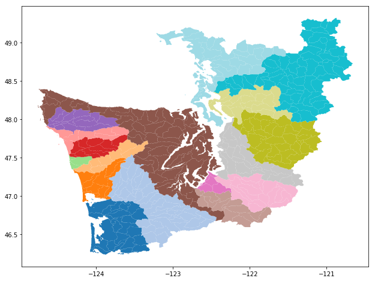
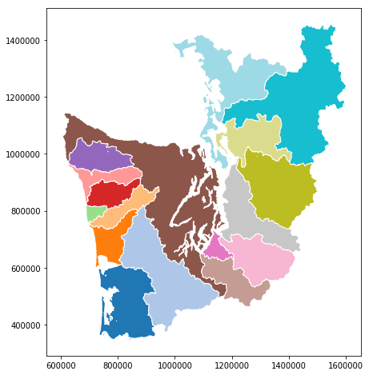
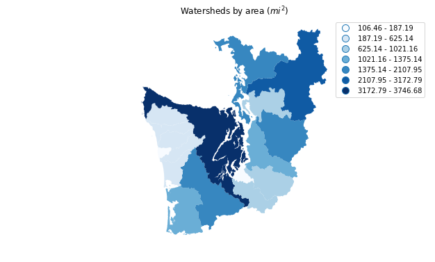
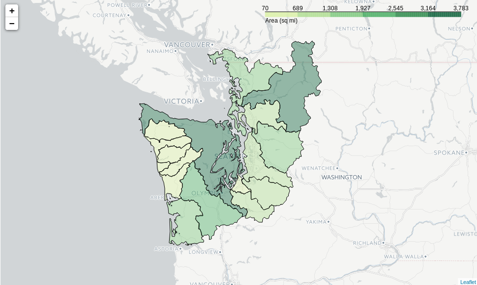
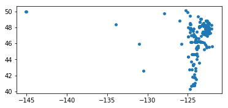
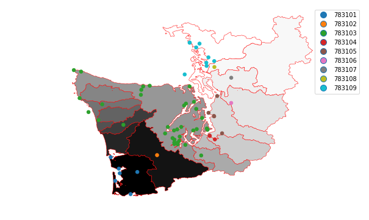
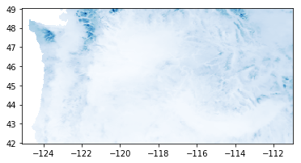
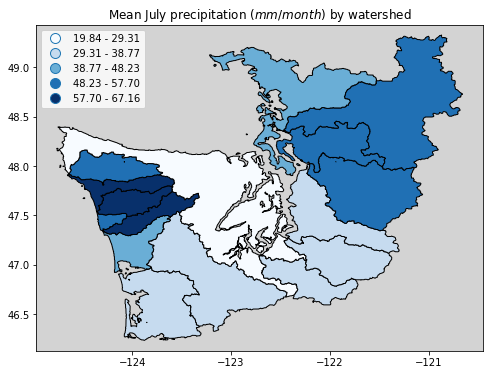

## View episode content in a Jupyter Notebook

[Open the Jupyter Notebook in nbviewer](https://github.com/geohackweek/tutorial_contents/blob/master/vector/notebooks/geopandas_advanced.ipynb)


## GeoPandas: Advanced topics
[Emilio Mayorga, University of Washington](https://github.com/emiliom/). 2018-9-9

## 1. Introduction

We covered the basics of GeoPandas in the previous episode and notebook. Here, we'll extend that introduction to illustrate additional aspects of GeoPandas and its interactions with other Python libraries, covering fancier mapping, analysis (unitary and binary spatial operators), raster zonal stats + GeoPandas. 

**Here are the main sections in this episode / notebook:**
* Read HydroBASINS for Western Washington from a PostGIS / PostgreSQL relational database on the cloud
* Dissolve into larger watersheds, and reproject
* Plot `choropleth` map based on calculated watershed areas
* Choropleth map as an interactive map with folium
* Spatial join, `sjoin`, of polygons on points
* rasterstats: "zonal" statistics from polygons on rasters

## 2. Set up packages and data file path
We'll use these throughout the rest of the tutorial.



%matplotlib inline

from __future__ import (absolute_import, division, print_function)
import os
import json
import psycopg2

import matplotlib as mpl
import matplotlib.pyplot as plt

from shapely.geometry import Point
import pandas as pd
import geopandas as gpd
from geopandas import GeoSeries, GeoDataFrame

data_pth = "../data"




mpl.__version__, pd.__version__, gpd.__version__



    ('2.2.3', '0.23.4', '0.4.0')



with open(os.path.join(data_pth, "db.json")) as f:
    db_conn_dict = json.load(f)


## 3. Read HydroBASINS North America dataset, extracting Western Washington
Read [HydroBASINS](http://hydrosheds.org/page/hydrobasins) "all-levels" (lev00) hierarchical watersheds dataset for North America and the Caribbean (`hybas_na_lev00_v1c`), from Amazon Cloud PostgreSQL/PostGIS database. **Watersheds in the dataset are at the finest (highest resolution) "Pfastetter" hierarchical level, level 12.** HydroBASINS dataset technical documentation is [here](http://hydrosheds.org/images/inpages/HydroBASINS_TechDoc_v1c.pdf).

`read_postgis` is called as before, except now we'll apply a SQL filter (server side) to the PostGIS dataset to select only the Pfastetter level-4 watershed with code 7831: `WHERE pfaf_4 = 7831`. This is **most of Western Washington.** Watershed polygons will still be read at their original level 12 resolution.

For a more in-depth look at interacting with spatial relational databases, see the eScience Institute tutorial [Introduction to SQL and Geospatial Data Processing](https://uwescience.github.io/SQL-geospatial-tutorial/)



conn = psycopg2.connect(**db_conn_dict)




hydrobas_ww = gpd.read_postgis(
    "SELECT * FROM hybas_na_lev00_v1c WHERE pfaf_4 = 7831", conn, 
    geom_col='polygongeom',
    coerce_float=False)




conn.close()




hydrobas_ww.crs



    {'init': 'epsg:4326'}



len(hydrobas_ww)



    413


413 polygon features returned. Let's examine the attributes available, using the first feature as an example.



hydrobas_ww.iloc[0]



    gid                                                        19945
    hybas_id                                             7.00001e+09
    next_down                                                      0
    next_sink                                            7.00001e+09
    main_bas                                             7.00001e+09
    dist_sink                                                      0
    dist_main                                                      0
    sub_area                                                   135.4
    up_area                                                    135.4
    endo                                                           0
    coast                                                          0
    order                                                          1
    sort                                                       19945
    pfaf_1                                                         7
    pfaf_2                                                        78
    pfaf_3                                                       783
    pfaf_4                                                      7831
    pfaf_5                                                     78310
    pfaf_6                                                    783101
    pfaf_7                                                   7831010
    pfaf_8                                                  78310101
    pfaf_9                                                 783101010
    pfaf_10                                              7.83101e+09
    pfaf_11                                              7.83101e+10
    pfaf_12                                              7.83101e+11
    polygongeom    (POLYGON ((-123.35 46.36666666666669, -123.349...
    Name: 0, dtype: object


**Plot a categorical map with coloring based on the aggregating column `pfaf_7`.** Watershed *boundaries* are at the high-resolution Pfastetter level 12.   
Note: pick a color map (`cmap`) appropriate for your data. [Get to know the matplotlib color maps.](https://matplotlib.org/tutorials/colors/colormaps.html)



hydrobas_ww.plot(column='pfaf_7', cmap='tab20', categorical=True, figsize=(14, 8));






### Rename the GeoDataFrame geometry column from `polygongeom` to `geometry` to avoid issues with other packages
Unfortunately, `folium` choropleth and `rasterstats` (demonstrated below) require the geometry column to be named "geometry". So, we'll rename it here first.



hydrobas_ww = hydrobas_ww.rename(columns={'polygongeom': 'geometry'})
hydrobas_ww._geometry_column_name = 'geometry'


## 4. Dissolve into larger watersheds, and reproject

### Dissolve source polygons into larger watersheds based on attribute values
Apply GeoDataFrame [dissolve](http://geopandas.org/aggregation_with_dissolve.html) aggregation method (implemented from lower level `shapely` operators) on level-7 Pfastetter codes (`pfaf_7`) shown in the plot above. Aggregate attributes, retaining only `pfaf_7` and `pfaf_6` (plus `geometry`, of course). This operation results in only 17 polygons, from the original 413.



cols = ['pfaf_6', 'pfaf_7', 'geometry']
hydrobas_ww_p7 = hydrobas_ww[cols].dissolve(by='pfaf_7', aggfunc='first', as_index=False)
len(hydrobas_ww_p7)



    17


Let's examine some of the features.



hydrobas_ww_p7.head()



<div>
<style scoped>
    .dataframe tbody tr th:only-of-type {
        vertical-align: middle;
    }

    .dataframe tbody tr th {
        vertical-align: top;
    }

    .dataframe thead th {
        text-align: right;
    }
</style>
<table border="1" class="dataframe">
  <thead>
    <tr style="text-align: right;">
      <th></th>
      <th>pfaf_7</th>
      <th>geometry</th>
      <th>pfaf_6</th>
    </tr>
  </thead>
  <tbody>
    <tr>
      <th>0</th>
      <td>7831010</td>
      <td>(POLYGON ((-123.4666666666666 46.2666666666666...</td>
      <td>783101</td>
    </tr>
    <tr>
      <th>1</th>
      <td>7831020</td>
      <td>POLYGON ((-123.1791666666666 46.33333333333336...</td>
      <td>783102</td>
    </tr>
    <tr>
      <th>2</th>
      <td>7831031</td>
      <td>(POLYGON ((-123.9597222222222 46.9666666666667...</td>
      <td>783103</td>
    </tr>
    <tr>
      <th>3</th>
      <td>7831032</td>
      <td>POLYGON ((-123.8583333333333 47.39583333333336...</td>
      <td>783103</td>
    </tr>
    <tr>
      <th>4</th>
      <td>7831033</td>
      <td>POLYGON ((-124.3 47.34583333333336, -124.30221...</td>
      <td>783103</td>
    </tr>
  </tbody>
</table>
</div>


Plot the results. Looks like the previous plot, except the polygon boundaries are now the pfaf_7 watersheds.



hydrobas_ww_p7.plot(column='pfaf_7', cmap='tab20', categorical=True, edgecolor='white',
                    figsize=(14, 8));



> ## Beware of invalid geometries!
> **Beware that `dissolve` may fail if there are "invalid" geometries.**
> This code is based on a GeoDataFrame examined in the previous, intro notebook. The 6 geometries/points reported are invalid (and are reported by the `is_valid()` method). This dissolve statement does work, though.
> ```python
> seas_grp = seas[['oceans', 'geometry']]
> seas_oceans_diss = seas_grp[seas_grp.geometry.is_valid].dissolve(by='oceans')
> 
> Ring Self-intersection at or near point 10.407218181818182 54.821390909090908
> Self-intersection at or near point -79.365827272727287 76.296645454545455
> Ring Self-intersection at or near point 10.979445510225332 54.380555030408686
> Ring Self-intersection at or near point 133.61550925464189 -4.3005540903175188
> Ring Self-intersection at or near point 121.91067196634913 -5.0593090510592447
> Ring Self-intersection at or near point 115.29553592754269 -7.0082630551828515
```
{: .callout}

### Reproject (transform) to WA State Plane South, epsg:2927
Partly so we can calculate polygon areas in linear units, not geodetic degrees. But also because that's the projection used by most state and local governments in Washington.
* http://epsg.io/2927
* http://spatialreference.org/ref/epsg/2927/
* [Report from http://www.epsg-registry.org](http://www.epsg-registry.org/report.htm?type=selection&entity=urn:ogc:def:crs:EPSG::2927&reportDetail=short&style=urn:uuid:report-style:default-with-code&style_name=OGP%20Default%20With%20Code&title=EPSG:2927)

No need to go to a web site to learn more about what `epsg:2927` is. Use `pyepsg`, which issues queries to http://epsg.io web services.



import pyepsg


Extract the epsg code from the string returned by `crs['init']`, then query epsg `2927`.



hydrobas_ww_p7_epsg_str = hydrobas_ww_p7.crs['init'].split(':')[1]
pyepsg.get(hydrobas_ww_p7_epsg_str)



    <GeodeticCRS: 4326, WGS 84>



pyepsg.get('2927')



    <ProjectedCRS: 2927, NAD83(HARN) / Washington South (ftUS)>


**Apply the crs transformation (reprojection)** using `to_crs` method.



hydrobas_ww_p7_wasp = hydrobas_ww_p7.to_crs(epsg=2927)


**Plot the reprojected map.** Note that, being in a planar project (not geodetic), the shape looks different compared to the previous map. More "normal". And the axes are now in `feet` relative to some origin.



hydrobas_ww_p7_wasp.plot(column='pfaf_7', cmap='tab20', categorical=True, edgecolor='white',
                         figsize=(14, 8));






## 5. Plot `choropleth` map based on calculated watershed areas
As the projection is in `feet`, auto-calculated polygon areas will be in feet<sup>2</sup>. So let's convert to miles<sup>2</sup> first (why not!). We'll add a new column to the GeoDataFrame.



hydrobas_ww_p7_wasp['area_mi2'] = hydrobas_ww_p7_wasp.geometry.area / 27878400
hydrobas_ww_p7_wasp.head(3)



<div>
<style scoped>
    .dataframe tbody tr th:only-of-type {
        vertical-align: middle;
    }

    .dataframe tbody tr th {
        vertical-align: top;
    }

    .dataframe thead th {
        text-align: right;
    }
</style>
<table border="1" class="dataframe">
  <thead>
    <tr style="text-align: right;">
      <th></th>
      <th>pfaf_7</th>
      <th>geometry</th>
      <th>pfaf_6</th>
      <th>area_mi2</th>
    </tr>
  </thead>
  <tbody>
    <tr>
      <th>0</th>
      <td>7831010</td>
      <td>(POLYGON ((890315.2572612347 354459.8899780738...</td>
      <td>783101</td>
      <td>1375.137396</td>
    </tr>
    <tr>
      <th>1</th>
      <td>7831020</td>
      <td>POLYGON ((963803.8027083561 376154.9965688475,...</td>
      <td>783102</td>
      <td>2107.945774</td>
    </tr>
    <tr>
      <th>2</th>
      <td>7831031</td>
      <td>(POLYGON ((776917.1877152125 614568.383332147,...</td>
      <td>783103</td>
      <td>528.472846</td>
    </tr>
  </tbody>
</table>
</div>


> ## Pandas `groupby` aggregation
> Now you could get the area of a pfaf_6 watershed via simple Pandas DataFrame `groupby` aggregation (sum).
{: .callout}


Plot the choloropleth, using `area_mi2`.

The "fisher_jenks" value segmentation `scheme` (using 7 segments, k=7) used is one of the available `pysal.esda.mapclassify.Map_Classifier` classifiers from the powerful [PySAL package](http://pysal.org/) (Python Spatial Analysis Library); GeoPandas can use these classifiers if PySAL is installed, as it is here. To get the list of classifiers, use:
```python
import pysal
print(pysal.esda.mapclassify.Map_Classifier.__doc__)
```



f, ax = plt.subplots(1, figsize=(10, 6))
ax.set_title('Watersheds by area ($mi^2$)')
hydrobas_ww_p7_wasp.plot(column='area_mi2', scheme='fisher_jenks', k=7, 
                         cmap=plt.cm.Blues, legend=True, ax=ax)
ax.set_axis_off()
plt.axis('equal');


    /home/mayorga/miniconda/envs/vectoernv_ghw18/lib/python3.6/site-packages/pysal/__init__.py:65: VisibleDeprecationWarning: PySAL's API will be changed on 2018-12-31. The last release made with this API is version 1.14.4. A preview of the next API version is provided in the `pysal` 2.0 prelease candidate. The API changes and a guide on how to change imports is provided at https://pysal.org/about
      ), VisibleDeprecationWarning)





> ## Time to Explore
> Let's stop for a bit to explore on your own, hack with your neighbors, ask questions.
{: .callout}


## 6. Choropleth map as an interactive map with folium
[Folium](https://github.com/python-visualization/folium) is very cool, specially for use in Jupyter notebooks; or to export into stand-alone HTML.



import folium




folium.__version__



    '0.6.0'


`m.choropleth` internally splits the geometry from the other attributes in `hydrobas_ww_p7_wasp`, and rejoins them based on the key `pfaf_7`. `key_on` uses an attribute reference derived from GeoJSON representations; this is awkward, and hopefully will be simplified in future folium implementations.



hydrobas_ww_p7_wasp.head()



<div>
<style scoped>
    .dataframe tbody tr th:only-of-type {
        vertical-align: middle;
    }

    .dataframe tbody tr th {
        vertical-align: top;
    }

    .dataframe thead th {
        text-align: right;
    }
</style>
<table border="1" class="dataframe">
  <thead>
    <tr style="text-align: right;">
      <th></th>
      <th>pfaf_7</th>
      <th>geometry</th>
      <th>pfaf_6</th>
      <th>area_mi2</th>
    </tr>
  </thead>
  <tbody>
    <tr>
      <th>0</th>
      <td>7831010</td>
      <td>(POLYGON ((890315.2572612347 354459.8899780738...</td>
      <td>783101</td>
      <td>1375.137396</td>
    </tr>
    <tr>
      <th>1</th>
      <td>7831020</td>
      <td>POLYGON ((963803.8027083561 376154.9965688475,...</td>
      <td>783102</td>
      <td>2107.945774</td>
    </tr>
    <tr>
      <th>2</th>
      <td>7831031</td>
      <td>(POLYGON ((776917.1877152125 614568.383332147,...</td>
      <td>783103</td>
      <td>528.472846</td>
    </tr>
    <tr>
      <th>3</th>
      <td>7831032</td>
      <td>POLYGON ((808869.5755557655 769864.5311527567,...</td>
      <td>783103</td>
      <td>441.528065</td>
    </tr>
    <tr>
      <th>4</th>
      <td>7831033</td>
      <td>POLYGON ((698711.1808079176 756609.8674803674,...</td>
      <td>783103</td>
      <td>106.456891</td>
    </tr>
  </tbody>
</table>
</div>



m = folium.Map(location=[47.8, -122.5], zoom_start=7, tiles="cartodbpositron")

m.choropleth(
    geo_data=hydrobas_ww_p7_wasp,
    data=hydrobas_ww_p7_wasp,
    columns=['pfaf_7', 'area_mi2'],
    key_on='feature.properties.pfaf_7',
    legend_name='Area (sq mi)', 
    fill_color='YlGn',
    fill_opacity=0.4,
    highlight=True)

m






This map is interactive, so play with it (zoom and pan). There is a lot more to explore in Folium! This is just a teaser.

## 7. Spatial join, `sjoin`, of polygons on points
We'll use an old, local snapshot of NANOOS coastal and marine monitoring stations in the Pacific NW, from the [NANOOS Visualization System (NVS) Data Explorer](http://nvs.nanoos.org/Explorer). While many stations are moorings on marine waters, some are inshore or in tidal shores and will overlap the watershed boundaries. The point file is in the [GeoPackage](http://www.geopackage.org) format, an OGC format implemented in SQLite.



nanoosstations_gdf = gpd.read_file(os.path.join(data_pth, "nanoos_nvs.gpkg"))
len(nanoosstations_gdf)



    194



nanoosstations_gdf.iloc[-1]



    platform_label                                     WADOH_HendrsnBay1
    platform_type                                   Fixed Shore Platform
    name                                     Henderson Bay site, W shore
    short_name                                       WADOH Henderson Bay
    lat                                                          47.3612
    lon                                                         -122.697
    state                                                     Washington
    region                                                   Puget Sound
    provider                                                       WADOH
    provider_url                                   http://www.doh.wa.gov
    provider_type                                                  State
    data_source                                                  Decagon
    data_source_url                               http://www.decagon.com
    url                http://www.doh.wa.gov/CommunityandEnvironment/...
    status                                                        online
    status_date                                     2016-06-24T18:00:00Z
    nvs_station_url    http://nvs.nanoos.org/Explorer?action=oiw:fixe...
    geometry                                   POINT (-122.6966 47.3612)
    Name: 193, dtype: object


Points are on the coasts of the Pacific NW (BC, WA, OR) and out in the open ocean.



nanoosstations_gdf.plot(markersize=15);






**Apply "inner" spatial join with the `sjoin` operator**. An inner join will retain only overlapping features. Then plot as a map overlay on top of `hydrobas_ww_p7`, categorizing (coloring) each point by the `pfaf_6` watershed it's in.



nanoossta_hydrobas_ww_gdf = gpd.sjoin(nanoosstations_gdf, hydrobas_ww_p7, how="inner")
len(nanoossta_hydrobas_ww_gdf)



    63



f, ax = plt.subplots(1, figsize=(10, 6))
ax.set_axis_off()
plt.axis('equal')
hydrobas_ww_p7.plot(ax=ax, cmap='Greys_r', linewidth=0.5, edgecolor='red')
nanoossta_hydrobas_ww_gdf.plot(column='pfaf_6', markersize=30, 
                               categorical=True, legend=True, ax=ax);






## 8. rasterstats: "zonal" statistics from polygons on rasters
We'll end by mixing features from a GeoDataFrame with a raster, applying zonal statistics using the cool and light weight [rasterstats](https://github.com/perrygeo/python-rasterstats) package.

Monthly Juy long-term climatology precipitation. The original monthly time series data are from the [PRISM Climate Group](http://prism.oregonstate.edu); the monthly climatology and Pacific NW clip were created by your truly and Don Setiawan for the [BiGCZ project](http://bigcz.org).



ppt_july_tif_pth = os.path.join(data_pth, 'prism_precipitation_july_climatology.tif')


### rasterio

`rasterstas` uses [rasterio](https://mapbox.github.io/rasterio) to read rasters (and `fiona` to read vector datasets), so we'll first do a quick exploration of rasterio.



import rasterio
import rasterio.plot as rioplot




rasterio.__version__



    '1.0.3'



ppt_july = rasterio.open(ppt_july_tif_pth)
ppt_july



    <open DatasetReader name='../data/prism_precipitation_july_climatology.tif' mode='r'>


Examine the metadata read from the raster file (we can confirm CRS is epsg:4326), then plot the raster. 



ppt_july.meta




    {"driver": "GTiff",
     "dtype": "float32",
     "nodata": -9999.0,
     "width": 353,
     "height": 177,
     "count": 1,
     "crs": CRS({"init": "epsg:4326"}),
     "transform": Affine(0.04, 0.0, -125.12921197411002,
            0.0, -0.04, 49.045740291264174)}




rioplot.show(ppt_july, with_bounds=True, cmap=plt.cm.Blues);






### Apply rasterstas `zonal_stats`

Apply `zonal_stats` from `rasterstats` package. Can pass a `GeoDataFrame` directly (instead of the file path to a GIS file) because it implements our old friend, the `__geo_interface__` method. For the raster, we pass its file path.

`zonal_stats` returns a geojson with the original properties plus the zonal statistics.



import rasterstats as rs




rs.__version__



    '0.13.0'



zonal_ppt_gjson = rs.zonal_stats(hydrobas_ww_p7, ppt_july_tif_pth, prefix='pptjuly_',
                                 geojson_out=True)




type(zonal_ppt_gjson), len(zonal_ppt_gjson)



    (list, 17)



zonal_ppt_gdf = GeoDataFrame.from_features(zonal_ppt_gjson)
zonal_ppt_gdf.head(2)



<div>
<style scoped>
    .dataframe tbody tr th:only-of-type {
        vertical-align: middle;
    }

    .dataframe tbody tr th {
        vertical-align: top;
    }

    .dataframe thead th {
        text-align: right;
    }
</style>
<table border="1" class="dataframe">
  <thead>
    <tr style="text-align: right;">
      <th></th>
      <th>geometry</th>
      <th>pfaf_6</th>
      <th>pfaf_7</th>
      <th>pptjuly_count</th>
      <th>pptjuly_max</th>
      <th>pptjuly_mean</th>
      <th>pptjuly_min</th>
    </tr>
  </thead>
  <tbody>
    <tr>
      <th>0</th>
      <td>(POLYGON ((-123.4666666666666 46.2666666666666...</td>
      <td>783101</td>
      <td>7831010</td>
      <td>259</td>
      <td>49.824776</td>
      <td>33.674382</td>
      <td>23.438837</td>
    </tr>
    <tr>
      <th>1</th>
      <td>POLYGON ((-123.1791666666666 46.33333333333336...</td>
      <td>783102</td>
      <td>7831020</td>
      <td>404</td>
      <td>96.738289</td>
      <td>29.443886</td>
      <td>15.356521</td>
    </tr>
  </tbody>
</table>
</div>


#### And finally, a choropleth map of July precipitation by watershed! With a good bit of plot tweaking.



f, ax = plt.subplots(1, figsize=(8, 6))
ax.set_title('Mean July precipitation ($mm/month$) by watershed')
zonal_ppt_gdf.plot(ax=ax, column='pptjuly_mean', scheme='Equal_Interval', k=5, 
                   cmap=plt.cm.Blues, linewidth=1, edgecolor='black', 
                   legend=True, legend_kwds={'loc': 'upper left'})
ax.set_facecolor("lightgray")
plt.axis('equal');






## 9. Other resources, tools, and overlap with other tutorials
* Advanced vector geospatial analytics
  * Go over all the analytics that have been wrapped into GeoPandas, including [Geometric Manipulations](http://geopandas.org/geometric_manipulations.html), [Set-Operations with Overlay](http://geopandas.org/set_operations.html), [Aggregation with Dissolve](http://geopandas.org/aggregation_with_dissolve.html) and [Merging Data](http://geopandas.org/aggregation_with_dissolve.html)
  * Use [PySAL](http://pysal.org), the Python Spatial Analysis Library! It's in the conda environment (version 1.14.4). This is a powerful, multi-faceted package. But watch out for the current transition from "version 1" to "version 2".
* Visualizations
  * [GeoPlot](https://residentmario.github.io/geoplot/index.html) makes it easy to generate a variety of useful plots from GeoDataFrames. It's available in the conda environment. [Here is a gallery of GeoPlot plots from GeoPandas](http://geopandas.org/gallery/plotting_with_geoplot.html)
  * More spatial visualization options are coming in the [Visualization tutorial](https://geohackweek.github.io/visualization/). Stay tuned, or look it up now. The mapping packages it'll cover include [cartopy](https://scitools.org.uk/cartopy/docs/latest/), [GeoViews](http://geoviews.org/) and [Folium](http://python-visualization.github.io/folium/) (we only covered a small subset of Folium capabilities, just to give you a taste)
  * See the [Python mapping libraries tour](https://github.com/oceanhackweek/ohw2018_tutorials/tree/master/day3/geospatial_and_mapping_tools) from OceanHackWeek 2018 last month.
* Overlap with raster processing
  * We illustrated `rasterstats` and [rasterio](https://rasterio.readthedocs.io/en/latest/). `rasterio` will be a pretty important component of your raster handling and manipulation toolbox. And it interacts with the GeoJSON-like objects we've examined; for example, see its [features module](https://rasterio.readthedocs.io/en/latest/topics/features.html).
  * [regionmask](https://regionmask.readthedocs.io/) works nicely with GeoDataFrames to support gridded operations, including ones in `xarray` that you'll see in the [nDarrays tutorial](https://geohackweek.github.io/nDarrays/)
